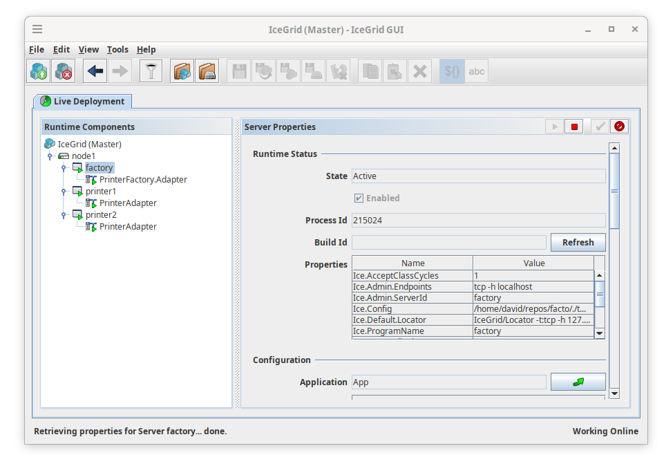

A server that create objects spawing IceGrid servers.

## Running

Start an IceGrid Registry and Node and add IceGrid application (app.xml). This App deploys a PrinterFactory, an object able to spawn Printer IceGrid servers.

    $ make add-app  (that also executes 'start' rule)

Run client:

    $ ./client.py --Ice.Config=locator.config factory

The factory will instantiate the 'PrinterTemplate' in 'node1' setting 'printer1' as identity. Then it returns the object proxy, that client invokes.

To stop and clean:

    $ make clean   (that also executes 'stop' rule)

