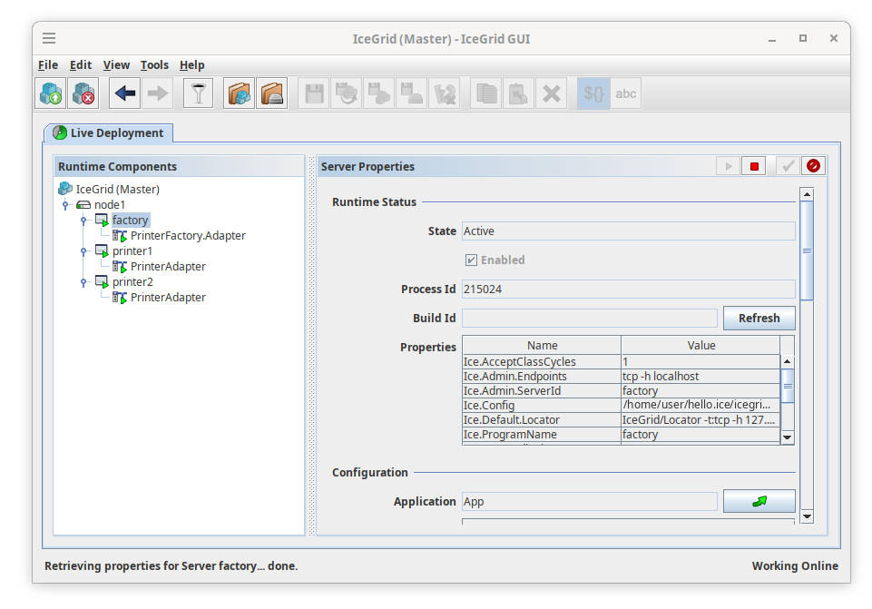

A server that creates objects by spawning IceGrid servers.

## Running

Start an IceGrid Registry and Node and add IceGrid application (app.xml). This App includes a PrinterFactory, an object able to spawn Printer IceGrid servers.

    $ make load-app  (that also executes 'start' rule)

Run client:

    $ ./client.py --Ice.Config=locator.config factory

The client asks the factory for 'printer1' and 'printer2'. 'printer1' is already declared in app.xml, so the factory just starts it if needed. 'printer2' does not exist, so the factory instantiates the 'PrinterTemplate' in 'node1' with 'printer2' as identity. In both cases it returns the object proxy, and the client invokes 'printer1'.

To stop and clean:

    $ make clean   (that also executes 'stop' rule)

## Permanent factory

This factory is activated on demand and stops 3 seconds after its last request (`Ice.ServerIdleTime` in app.xml), so it does not keep track of the servers it creates: they stay in the application until it is removed. A factory running as a permanent server, that removes the servers nobody uses anymore, also needs to:

- keep its admin session alive, calling `AdminSession.keepAlive` periodically (see `Registry.getSessionTimeout`),
- register a node observer (`AdminSession.setObservers`) to know when its servers become inactive,
- remove them from the application with `Admin.updateApplication`, listing them in `removeServers` of a `NodeUpdateDescriptor`.

